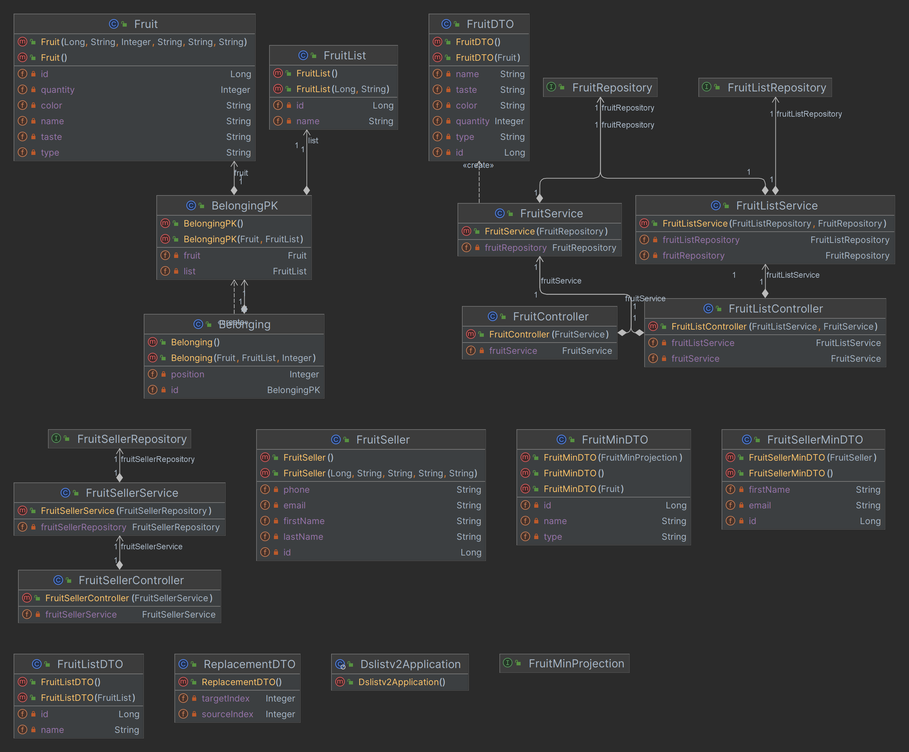

# DSListV2 - RESTful API for list management

The project aims to create a RESTful API with a backend in Java and Spring Boot.

## 📖 Introduction

This project was developed by me, through an event that took place during the month of July 2023, taught by Professor Nelio Alves.

The event calls "Intensivão Java Spring" is a bootcamp aimed at web developing a Backend Spring Boot application with Java.

## 🛠️ Architecture

The project use this layer pattern:

1. Frontend
   2. JSON (HTTP Requests)
3. Backend
   4. Controllers 
      5. DTO
   5. Transactions
      6. Services
      7. Entities
      8. Repositories
      9. Projections

With the image bellow you can visualize the layer pattern used, 
following the design standards of the current development market.

## 💡Initial Idea

This is the initial idea for the project:

## 🧱 Domain Model

This is the domain model for the project,
it was built using the Astah modeling software,
in the free version of the community,
where through it, it is possible to view the **names of the
tables**, **columns**, **relationships**, **cardinalities** and **primary keys**.

## 🗒️ Diagrams

This is the class diagram of the project, 
it was generated through the IntelliJ IDE,
contains all relationships between classes,
**data types**, **methods** and **attributes**, 
being very useful to visualize the entire operation. 

## 🚀 Starting

Cloning with SSH KEY

``git clone git@github.com:olvericc/dsListV2.git``

Cloning with HTTPS Protocol

``git clone https://github.com/olvericc/dsListV2.git``

## 📋 Prerequisites

* IDE - IntelliJ IDEA Ultimate;
* SGBD - DBeaver Community;
* APIs - Postman;
* VSC - Git;
* SDK - JDK 17 LST (Zulu);
* Compilation Tool - Maven;
* DB - Postgres;
* DB - H2 Database;

## 🔧 Installation

To create your development environment, follow these steps

### 🐋 Docker

Type following commands in project root folder with yml file

You need to run these commands in terminal, on the docker folder (for example: C:\dev\ws-java\dsListV2\docker), with the **docker-compose.yml**

``docker-compose build``

``docker-compose up``

### ⌨️ IntelliJ

with your IDE open, launch the Spring Boot application via the build tool.

### Or you can build in terminal

Here are the basic steps to run a Spring Boot application through the terminal:

1. Make sure you have the JDK (Java Development Kit) installed on your system and properly configured in the PATH.
2. Build the JAR package of your Spring Boot application using Maven or Gradle. 
For Maven, you can use the following command in the root of the project (where the pom.xml file is located):

``mvn package``

This will compile your Spring Boot project, run tests, 
and generate the JAR file in the "target" folder of your project directory.

3. Navigate to the folder where the JAR file was generated, for example:

``cd target java -jar filename.jar``

4. Replace "filename.jar" with the actual name of the JAR file generated by your application.

If you follow these steps correctly and your Spring Boot application is configured properly, 
it will start up and be accessible at http://localhost:8080 or another configured port, as mentioned earlier.

### 📫 Postman

Follow these steps to set up Postman and test your RESTful API:

1. Import the API Collection: https://documenter.getpostman.com/view/21827047/2s946o5VJE
2. Test the Endpoints: 

Now you can start testing the endpoints.

Each request in the collection represents a specific API endpoint with its parameters and expected responses.

For example, to test the GET request for fetching a specific resource, select the corresponding request from the collection. 

Fill in any necessary parameters and click the "Send" button to execute the request. 

You'll receive the response from the server, which you can inspect and validate.

With Postman, you can thoroughly test your API, debug any issues, and ensure that it behaves as expected before deploying it to production.

## 🛠️ Built With

### tools and technologies I used to create my project

* Java - Programming language used.
  * Version: 17 LTS

* Spring Boot - Framework for building the application.
  * Version: 3.1.2 

* Maven - Dependency Manager.

* Spring Data JPA - Spring Framework subproject that supports and facilitates JPA (Java Persistence API) integration.

* H2 Database - In-memory database for testing.zzz

* PostgreSQL - Relational database management system.
  * Version: 15.0

## 📌 Version

Release 1.0

## ✒️ Authors

* Java Backend Developer - Initial part of project - Eric Lopes Oliveira 
  * [GitHub Profile](https://github.com/olvericc)
  * [LinkedIn Profile](https://www.linkedin.com/in/eric-lopes-oliveira-93a6061aa/)

## 📄 License

This project is under my license.

## 🔍 References

This project was based using this repository as a reference:

https://github.com/devsuperior/dslist-backend 

## 🎁 Thanks

* In this project is purely for academic purposes;
* I plan to add more libraries and adding new features in the future;
* I will add a frontend with Angular or React;
* The deployment will be completed in next version;